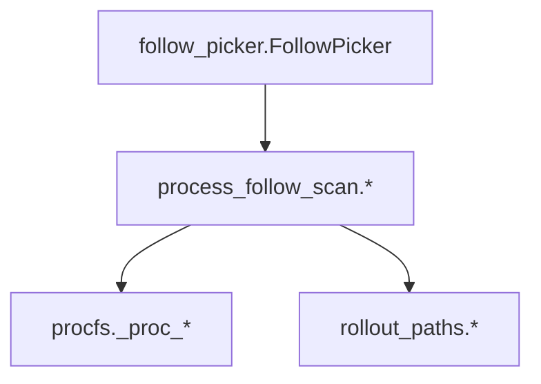

# 技术设计: FollowPicker 进程扫描逻辑解耦（Phase14）

## 技术方案
### 核心技术
- Python 标准库
- 现有 watch/procfs 与 watch/rollout_paths 工具函数

### 实现要点
- 新增 `codex_sidecar/watch/process_follow_scan.py`：只承载可复用的纯逻辑（进程匹配、候选 PID 扫描、进程树收集、rollout fd 解析与排序）
- `FollowPicker` 继续负责 selection_mode/pin/auto 的策略分支；内部调用新模块函数完成“发现/解析”
- 兼容性：保留 `follow_picker.py` 内部对 `_proc_*` 的引用路径，以便既有单测与 monkeypatch 能继续工作

## 架构设计

## 安全与性能
- **安全:** 不新增外部输入面；保持对路径的 CODEX_HOME 约束与基础异常隔离
- **性能:** 不改变现有 scan cadence；仍按 scan 周期全量刷新 `/proc`，确保新增会话能被发现

## 测试与部署
- **测试:** 新增单测覆盖：
  - 强匹配 fullmatch 行为（避免 codex-* 误命中）
  - 进程树收集与 fd flags（WRONLY/RDWR）过滤
- **部署:** 无额外步骤；仅内部模块拆分
