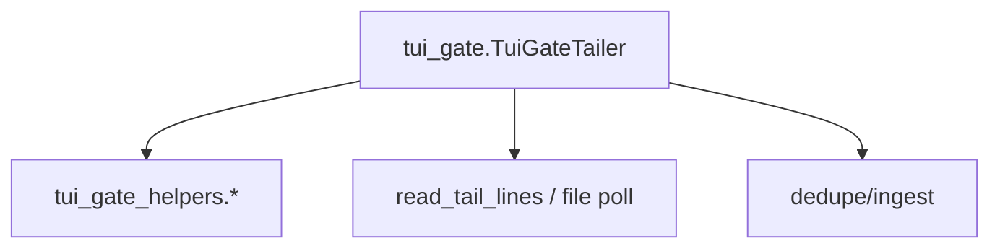

# 技术设计: TUI Gate 解析/渲染逻辑解耦（Phase15）

## 技术方案
### 核心技术
- Python 标准库（re/json/datetime/time）

### 实现要点
- 新增 `codex_sidecar/watch/tui_gate_helpers.py`：
  - `split_ts()`：拆分 `codex-tui.log` 的时间戳头
  - `parse_toolcall()`：解析 `ToolCall:` 行（必要时 JSON decode）
  - `ts_age_s()`：计算时间戳 age（用于过滤历史残留 waiting）
  - `format_tool_gate_md()`：生成最终 Markdown 文本（含脱敏与 tool 名映射）
- `TuiGateTailer` 保留对外接口与状态字段；原有 static/instance 方法保留为 wrapper，内部转调 helper（降低重构风险）

## 架构设计

## 安全与性能
- **安全:** helper 延续现有脱敏规则（sk-*/Bearer）；不新增外部输入面
- **性能:** 不改变读取策略与 scan cadence；仅减少单文件内耦合

## 测试与部署
- **测试:** 新增单测覆盖 `split_ts/parse_toolcall/format_tool_gate_md` 的关键分支
- **部署:** 无额外步骤；内部模块拆分
