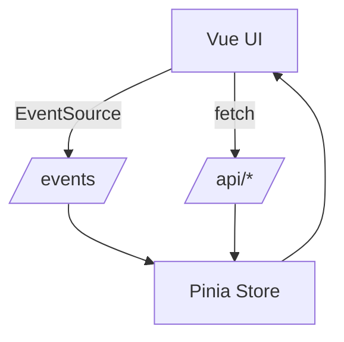

# 技术设计: 前端 UI 全量重构（Vue 3 + Vite）

## 技术方案

### 核心技术
- Vue 3（Composition API）
- Vite（构建期；产物静态分发）
- Pinia（状态管理）
- TypeScript（降低重构期回归风险）

### 与现有代码相容性（关键）
现有后端通过 Python 标准库 HTTP 服务分发 `ui/` 目录，并提供 `/events` 与 `/api/*`。重构后的 UI 只要满足：

- build 产物可落到 `tools/codex_thinking_sidecar/codex_thinking_sidecar/ui/`（或通过部署脚本同步到该目录）
- build `base` 为 `/ui/`，确保静态资源路径与现有路由一致
- 不引入必须的 history 路由（或使用 hash），避免后端新增 SPA fallback
- 继续调用原有 `/api/*` 与 `/events`，不要求后端配合变更

则可保持后端完全不改动而完成 UI 全量重写。

## 架构设计（简化）

## 架构决策 ADR

### ADR-001: 采用 Vue 3 + Vite（静态产物交付）
**上下文:** UI 交互与状态复杂度已超过手工 DOM 维护的可控边界。  
**决策:** Vue 3 组件化重写；Vite 仅用于构建；产物仍由 sidecar 静态分发。  
**替代方案:** 继续 Vanilla / Preact / Lit（在“全量重构 + 复杂交互”场景下综合收益不如 Vue）。  
**影响:** 引入 Node 构建链，但运行时保持 Python-only（如果产物入库或通过脚本生成）。

### ADR-002: 状态管理使用 Pinia
**上下文:** 会话/未读/SSE/翻译/抽屉等状态域多，需可预测的状态流转。  
**决策:** Pinia；对大对象用浅响应或分片策略避免性能开销。  
**影响:** 增加轻量依赖，降低长期维护成本。

### ADR-003: 长列表采用窗口化/虚拟列表
**上下文:** 万级消息量 + 高频更新，Vue 组件树全量 diff 风险高。  
**决策:** 窗口化/虚拟列表优先；保留“接近底部才自动滚动”等交互约束。  
**影响:** 需要处理高度测量与定位，但可换来性能上限。

### ADR-004: Markdown 渲染先复用 legacy 逻辑
**上下文:** legacy 已实现安全转义与表格/代码块渲染。  
**决策:** 先复用/迁移现有 Markdown 渲染模块，避免重构期安全与样式回归。  
**影响:** 需要抽取共享逻辑到 V2 工程内。

## 安全与性能

- 避免引入任何“远程执行入口”，保持旁路只读。
- `v-html`/富文本渲染必须保证转义或白名单化，避免 XSS。
- SSE 更新与 `op=update` 必须做合并更新，避免触发整列表重渲染。
- 长列表必须窗口化（或等效策略），避免 DOM 膨胀。

## 测试与部署

- 开发：启动 sidecar（提供 `/api/*` 与 `/events`）+ `npm run dev`（proxy）
- 部署：`npm run build` 产物同步到 `ui/`，通过 `http://127.0.0.1:8787/ui` 验证；保留 legacy UI 回滚路径

